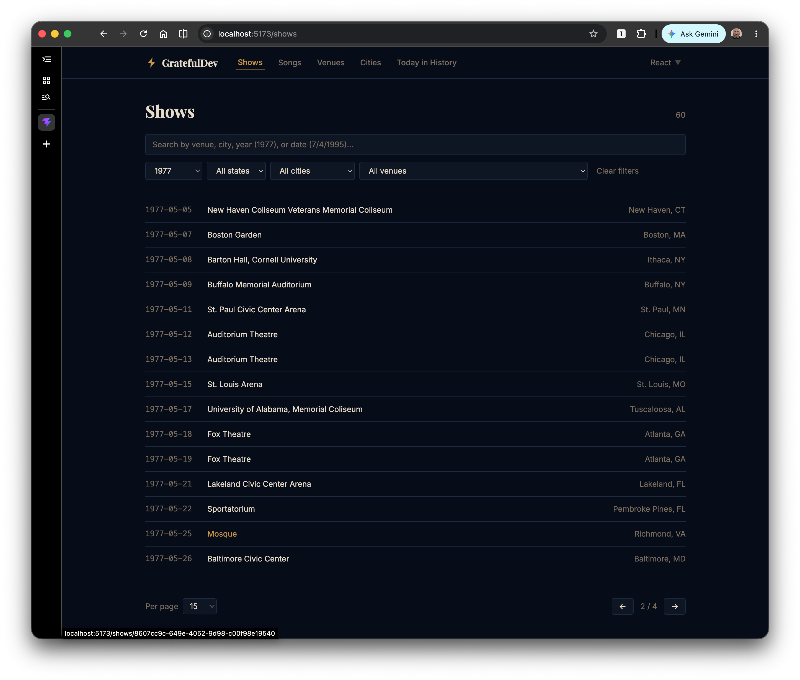
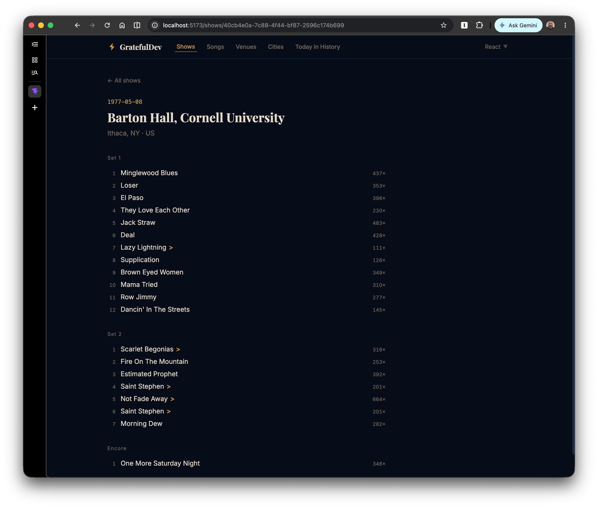
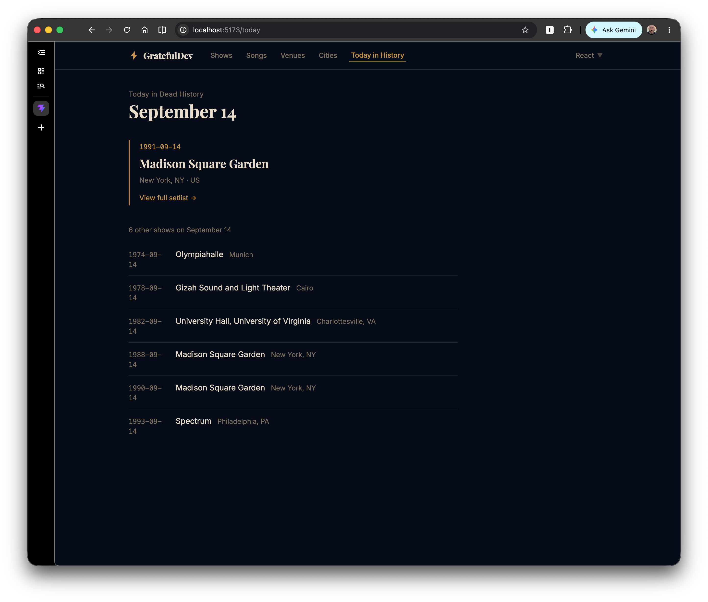

# GratefulDev

A portfolio project exploring 30 years of Grateful Dead live performance data (1965–1995). The same UI is implemented across four frontend approaches — React, Vue, Angular, and Rails+Hotwire — all reading from a shared set of static JSON files generated by a Rails 8 build tool.

<p align="center">
  
  
  
</p>

## What it is

The Grateful Dead played 2,358 shows and 526 unique songs over 30 years. Since all of that data is historical and never changes, the architecture leans into that: a Rails app seeds a local database from YAML source files and exports everything as static JSON. The frontends are pure static sites that read from those files, deployable to GitHub Pages with no server required.

The portfolio story is the comparison: same feature spec, same design system, four different frameworks. Each frontend's nav includes a **Benchmarks panel** showing live page load time, data fetch time, bundle size, and the key framework-specific patterns used to build it.

## Structure

```
gratefuldev/
  api/          Rails 8 app — local build tool, not deployed
  data/         Generated static JSON (committed)
    shows/      index.json + one file per show UUID
    songs/      index.json + one file per song UUID
    venues.json
    cities.json
  frontends/
    react/      Vite + React 19 + TypeScript + TanStack Query   → port 5173
    vue/        Vite + Vue 3 + TypeScript + Pinia               → port 5174
    angular/    Vite + Angular 18 + TypeScript + RxJS           → port 5175
    hotwire/    Rails 8 + Hotwire + Tailwind + Importmaps       → port 3001
```

## Features (all frontends)

- **Shows** — 2,358 shows with smart search (bare year, any date format, venue/city text), cascading year/state/city/venue filters, configurable pagination
- **Show detail** — full setlist with set/encore labels, inline segue arrows (`>`), per-song play counts
- **Songs** — 526 songs, searchable by name
- **Song detail** — total performances, every show it appeared in
- **Venues** — 595 venues by show count, click through to filtered shows
- **Cities** — 314 cities by show count, click through to filtered shows
- **Today in Dead History** — shows from today's month/day across all years, randomly featured one with links to all others

## Design

Consistent design system across all frontends: Tailwind v4 with shared color tokens (midnight indigo background, warm paper text, stage-light gold accent), Playfair Display + Inter typography, SVG lightning bolt logo.

## Running the build tool

```bash
cd api
bundle install
rails db:schema:load db:seed
rake data:export
```

Regenerates everything in `data/` from the YAML source files in `api/db/data/`. Only needed if you want to rebuild the data from scratch — `data/` is committed and ready to use.

## Running a frontend

```bash
# React (port 5173)
cd frontends/react && npm install && npm run dev

# Vue (port 5174)
cd frontends/vue && npm install && npm run dev

# Angular (port 5175)
cd frontends/angular && npm install --legacy-peer-deps && npm run dev

# Rails + Hotwire (port 3001)
cd frontends/hotwire && bin/dev
```

The JS dev servers proxy `data/` automatically — no separate API process needed. The Rails app uses its own SQLite database seeded from the same YAML source files.

For production bundle metrics in the JS Benchmarks panels:

```bash
npm run build && npm run preview
```

## Benchmarks panel

Each frontend has a framework badge in the top-right of the nav. Click it to open a panel showing:

- **Performance** — page load time and data fetch time (live via the Performance API in both dev and prod; bundle sizes require a production build)
- **Key patterns** — framework-specific decisions: how data caching, derived state, URL sync, and active nav state are handled in each framework
- **Cross-links** — quick links to the other running frontends

## Tech notes

- Ruby 3.3.3 via rvm; `json` gem pinned `< 3.0` (Rails 8 + json 3.0 incompatibility)
- UUID primary keys throughout; no integer IDs
- Tailwind v4 via `@tailwindcss/vite` with `@theme` custom tokens
- No backend needed at runtime — all data is static JSON served from `data/`

## Data source

Show and song data from [gdshowsdb](https://github.com/jefmsmit/gdshowsdb) by [@jefmsmit](https://github.com/jefmsmit). YAML files are vendored in `api/db/data/`.

## Status

- [x] Rails 8 build tool (`api/`)
- [x] Static JSON export (`data/`)
- [x] React frontend (`frontends/react/`)
- [x] Vue frontend (`frontends/vue/`)
- [x] Angular frontend (`frontends/angular/`)
- [x] Rails + Hotwire frontend (`frontends/hotwire/`)
